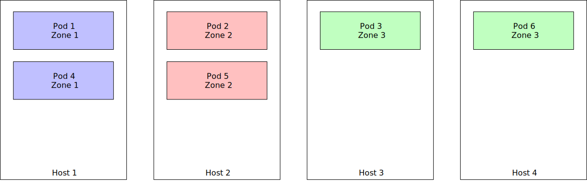
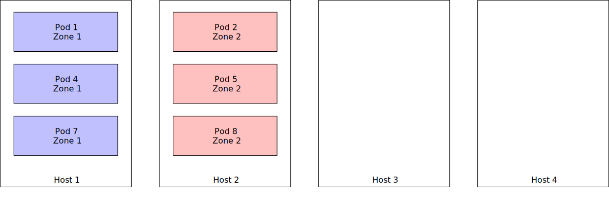
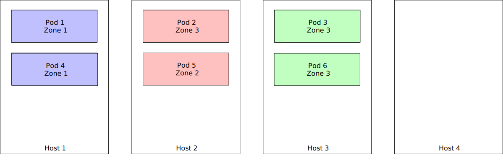
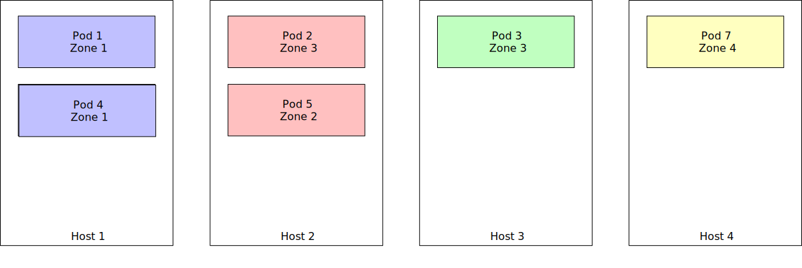

# Support bin packing of fault domains

## Metadata

* Authors: @johscheuer
* Created: 2021-10-01
* Updated: 2021-10-01

## Background

In the current implementation of the operator we try to distribute our Pod across as many fault domains as possible.
If a cluster has more fault domains than the operator creates Pods for a specific class all Pods will be on a different fault domain.
This has the drawback that the operator can only interact on a single Pod for safe operations e.g. to minimize the risk of data loss.
For clusters with a non-trivial amount of Pods this means that some operational tasks will take very long.
A better way would be to allow the operator to bin pack Pods in the same fault domain.

## General Design Goals

* Provide a way how a user can specify the number of logical fault domains
* The user should be able to decide if the number of logical fault domains is a requirement (default should be optional)

## Current Implementation

The current implementation adds a `preferredDuringSchedulingIgnoredDuringExecution` `PodAntiAffinity` to every Pod [code](https://github.com/FoundationDB/fdb-kubernetes-operator/blob/master/internal/pod_models.go#L308-L334).
The label selector will contain the process class and the cluster name, to ensure processes with the same class are distributed across different fault domains is possible.
A user can define additional `PodAntiAffinity`s but can't prevent the operator from creating the default `PodAntiAffinity`.
The only exception is the special fault domain `foundationdb.org/none` and `foundationdb.org/kubernetes-cluster`.

The reason why we use `preferredDuringSchedulingIgnoredDuringExecution` by default (and not `requiredDuringSchedulingIgnoredDuringExecution`) is to make sure that large FoundationDB clusters can still be scheduled on smaller Kubernetes clusters and in most cases having some pods co-located in the same fault domain is not an issue.

In the design we will use the following terms:

- `physical fault domain`: This refers to a fault domain that is available in Kubernetes e.g. a machine running the Kubernetes worker or a higher level fault domain like a rack, data hall etc.
  This will reflect an underlying physical fault domain.
- `logical fault domain`: The logical fault domain is not something that refers directly to a physical fault domain and can also be spread across multiple physical fault domains.
  The idea is to have a way to group some processes of a FoundationDB cluster together with the same zone ID, this zone ID will be a logical value like "zone-1".

## Proposed Design

The idea would be to use a custom label like `foundationdb.org/distribution-key`.
As value we will use a prefix for the `class` and a value defining in which zone the process should be running.
We will set the `FDB_ZONE_ID` environment variable on the Pod level to the value of the `foundationdb.org/distribution-key`, e.g. `storage-0`.
The current default value of `FDB_ZONE_ID` is the hostname.
In addition to that we change the `PodAntiAffinity` rule.
The following would be an example of the `affinity` term for a Pod.

```yaml
  affinity:
    # Affinity to schedule Pods with the same distribution key together
    podAffinity:
      preferredDuringSchedulingIgnoredDuringExecution:
      - podAffinityTerm:
          labelSelector:
            matchLabels:
              foundationdb.org/distribution-key: "storage-0"
              foundationdb.org/fdb-cluster-name: example-cluster
          topologyKey: fault_domain
        weight: 1
    # AntiAffinity to not schedule the Pod on the same fault domain where other Pods with a different distribution key are running
    podAntiAffinity:
      # The required statement is per default only allowed on the hostname:
      # https://kubernetes.io/docs/concepts/scheduling-eviction/assign-pod-node/#an-example-of-a-pod-that-uses-pod-affinity
      requiredDuringSchedulingIgnoredDuringExecution:
      - podAffinityTerm:
          labelSelector:
            matchExpressions:
            - key: "foundationdb.org/distribution-key"
              operator: NotIn
              values:
              - "storage-0"
            - key: "foundationdb.org/fdb-cluster-name"
              operator: In
              values:
              - "example-cluster"
          topologyKey: fault_domain
        weight: 1
```

The additional label and the `affinity` term enable the operator to spread Pods across physical fault domains.
The following code snippet shows a possible implementation of the required structs:

```golang
// DistributionConfig
type DistributionConfig struct {
    // Enabled defines if the binpacking is enabled or not.
    // Default: false
    Enabled *bool
    // DesiredFaultDomains desfines the number of desired fault domain.
    // Must be greater than 0 if fault domain distribution is enabled.
    // Default: Minimum number of fault domains.
    DesiredFaultDomains *int
}
```

The operator will try to spread the Pods equally across the logical fault domains.
Depending on the replacements for unreachable Pods we could use one logical fault domain more than another.
We also don't guarantee that we use exactly the number of `DesiredFaultDomains` e.g. when we spawn fewer processes than `DesiredFaultDomains`.

A change to `DesiredFaultDomains` will lead to a migration of a subset of Pods in order to honor the new affinity term.
The operator only tries to replace as many Pods as required to have all pods equally distributed across the logical fault domains.

## Scheduling and Eviction Policy

For the implementation we need two additional steps:

- The `AddProcessGroups` reconcile loop must be aware of the fault domains.
- The `ReplaceMisconfiguredProcessGroups` reconcile loop must be aware of the fault domains.

We will only count process groups that are not marked for removal.
The following calculation has to be done for every process class.
We can calculate the minimum and maximum number of Pods per fault domain with the following logic:

```
min := floor(desired process groups / desired fault domains)
max := ceil(desired process groups / desired fault domains)
```

The `AddProcessGroups` reconcile loop will add new process groups into the least full fault domains until they have at least `min` process groups.

The `ReplaceMisconfiguredProcessGroups` reconcile loop will replace Pods from the most full fault domains.
If a fault domain has more than `max` number of process groups running in a fault domain we have to replace `number of process groups - max`.

As an example:

- `desired process groups` is 10 and `desired fault domains` is 4, this means `max` is 3.
- If fault domain `Zone 1` has currently 4 process groups the operator will replace 1 process group.

For an easy way to query the process groups we will extend the current `ProcessGroupStatus` struct by a `FaultDomain` field.
Once a process group was bound to a logical fault domain it can't be moved to another one.

## Examples

In the following part we will have some different examples to demonstrate how the fault domain setup is working.

### Logical fault domain across physical fault domain

This example shows how two Pods of the same logical fault domain `Zone 3` are spread across two hosts e.g. physical fault domains.



### Reducing the number of DesiredFaultDomains

If we currently use `DesiredFaultDomains: 3`, with 6 Pods in total, and we reduce `DesiredFaultDomains: 2`, this will result in the following steps:

1. The operator will notice that all Pods from `Zone 3` must be Replaced.
1. Pod `Pod 7` will be scheduled for `Zone 1` and `Pod 8` will be scheduled of `Zone 2`
1. Once the old Pods `Pod 3` and `Pod 6` are excluded they will be removed.
1. We only use two logical fault domains `Zone 1` and `Zone 2`

Initial state:


End state:



### Increasing the number of DesiredFaultDomains

If we currently use `DesiredFaultDomains: 3`, with 6 Pods in total, and we increase `DesiredFaultDomains: 4`, this will result in the following steps:

1. The operator will notice that it should be using 4 fault domains instead of 3.
1. The operator will calculate based on the current number of process groups how many Pods we expect per Zone.
1. In this case we must have at least 1 Pod per zone and at most 2 Pods.
1. The operator will find a "victim" and replace that Pod.
1. The new Pod will be spawned in the new logical fault domain `Zone 4`

Initial state:



End state:




## Related Links

* [Inter-pod affinity and anti-affinity](https://kubernetes.io/docs/concepts/scheduling-eviction/assign-pod-node/#inter-pod-affinity-and-anti-affinity)
* [Automatic replacements if fault-domain is violated](https://github.com/FoundationDB/fdb-kubernetes-operator/issues/499)
* [Sidecar default FDB_ZONE_ID](https://github.com/apple/foundationdb/blob/6.3.22/packaging/docker/sidecar/sidecar.py#L230-L234)
