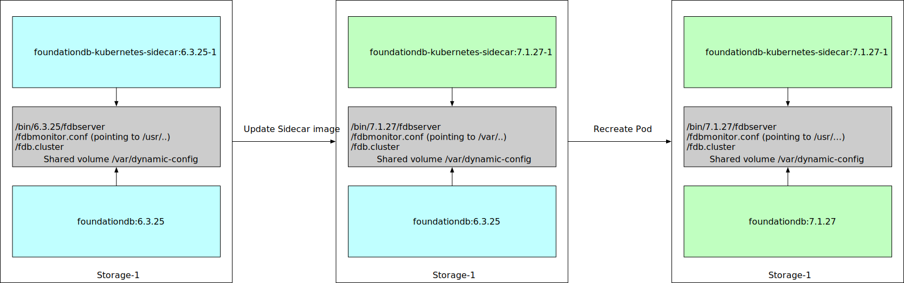

# FoundationDB Upgrades

## Overview

The FDB operator supports FDB clusters upgrades by adjusting the `version` setting in the `FoundationDBCluster` spec to the new desired version.
It also offers limited support for downgrades, the limitation is that the operator only supports downgrades to an older patch version of the running FDB version.
Upgrades of FoundationDB running on Kubernetes are challenging and the operator provides a way to handle a lot of the complexity on itself.
The document will describe the upgrade process in details and some cases the operator cannot handle currently.

FoundationDB upgrades for major and minor versions are incompatible and require that all processes are updated in a short time period.

### Upgrade Process Details

This document describes the upgrade process based on the operator version `v1.14.0` for older versions there might be a slight difference in how the operator is handling the upgrades.
In addition to that we are currently working on reducing the complexity for patch upgrades to reduce the upgrade steps to the [Recreation of old Pods](#recreation-of-pods-phase) phase.

The graphic below represents the different stages in a Pod during the upgrade:



The first state on the left is the initial state before the operator is doing any work.
The second state in the middle is the state of the Pod during the [Staging Phase](#staging-phase) and the [Restart Phase](#restart-phase).
The third and last state is the sta te after the [Recreation of Pods Phase](#recreation-of-pods-phase) where the according Pod was recreated with the new desired image version.


#### Pre Upgrade Check Phase

Before the upgrade is initiated the operator will perform a compatibility check for all clients of this cluster.
This check will ensure that a cluster is only upgraded if all clients support the new version, for patch upgrades this check is skipped.
More information about this reconciler can be found in the [technical design](technical_design.md#checkclientcompatibility).
Clients not supporting the new version will be reported in the logs of the operator with the message `Deferring reconciliation due to unsupported clients` and in addition the operator will emit a Kubernetes event.
This prevents upgrading a database until all clients have been updated with a compatible client library.

#### Staging Phase

This phase ensures that all Pods are in a state that the operator can restart all `fdbserver` processes and they will be restarting with the new FDB version.
The first step is the `UpdateSidecarVersions`, this subreconciler updates the image of the `foundationdb-kubernetes-sidecar` container to match the desired FDB version.
Updating the image of a single container doesn't require the recreation of the Pod and keeps the main container that runs the `fdbserver` process running.
The sidecar container will copy the new binary inside the main container over a shared volume.
In the main container the new binaries will be present in `/var/dynamic-conf/bin/$fdb_version`, this version will be used once the `fdbserver` process is restarted.
The `UpdatePodConfig` subreconciler will ensure that all Pods have the new configuration present and that the new binary is present in the shared volume.
This configuration ensures that the `fdbmonitor` will restart processes with the new binary located at `/var/dynamic-conf/bin/$fdb_version`.
Once all Pods have the new configuration and binaries present the operator can move to the next phase.

A potentional blocker for moving towards the next Phase can be an issue with a subset of the Pods e.g. if the sidecar is unreachable.
If the sidecar is unreachable the operator is not able to confirm that the new configuration and binary is in place.
All Process Groups affected by such an issue can be discovered with the `SidecarUnreachable` condition, until this issue is resolved the upgrade will be blocked.
The best way forward for this is to replace the affected Pods with the following [kubectl fdb plugin](../../kubectl-fdb/Readme.md) command:

```bash
kubectl fdb remove process-group -c cluster pod-1
```

If the whole Pod is affected by the networking issue the operator will replace the Pod automatically if automatic replacements are enabled, which is the default.
In order to replace the Pod the operator will wait for the Process Group to have a [failure condition](https://github.com/FoundationDB/fdb-kubernetes-operator/blob/v1.14.0/api/v1beta2/foundationdbcluster_types.go#L65) for at least the defined [FailureDetectionTimeSeconds](../cluster_spec.md#automaticreplacementoptions), by default those are 7200 seconds (2 hours).

#### Restart Phase

The `BounceProcesses` subreconciler will handle the restart of all `fdbserver` processes.
For FoundationDB clusters that are spanned across multiple Kubernetes clusters the operator will follow a special process which is document in the [technical design](technical_design.md#bounceprocesses).
The subreconciler will also ensure to wait until all `fdbserver` processes are ready to be restarted to prevent cases where only a subset of processes are restarted.
In this case ready means that all Pods have the new `fdbmonitor` configuration present and that the new binary is present in the shared volume at `/var/dynamic-conf/bin/$fdb_version`.
After the `kill` command the operator will initiate a new reconciliation loop to detect the new running version, this is handled in the `UpdateState` subreconciler and the version is detected based on the output of the [cluster status json](https://apple.github.io/foundationdb/mr-status.html).

#### Recreation of Pods Phase

Technically the upgrade is now done and the cluster is running on the new version but the operator has to do some cleanup.
The cleanup includes the recreation of all Pods to ensure they use the new FoundationDB image for the desired version and the configuration will be updated to point again to the binary present in the container.
Depending on the defined [Pod update strategy](../cluster_spec.md#podupdatestrategy) the operator will handle the recreation of the Pods differently.
In the default setting `ReplaceTransactionSystem` the operator will recreate the storage Pods zone by zone and replaces Pods of the transaction system (log and stateless processes).
The replacement of the transaction system has the benefit that the recoveries of the transaction system is reduced to potentially one recovery.
During this phase the operator will also run the `RemoveIncompatibleProcesses` subreconciler, this reconciler will recreate all Pods that host a `fdbserver` process that is in the list of the `incompatible_connections` and is missing the the process list of the [cluster status json](https://apple.github.io/foundationdb/mr-status.html).
This reconciler should ensure that the cluster is moving faster towards the desired configuration if some processes where not restarted properly.

Once all Pods are updated to the new image the upgrade is done and the cluster status of the FoundationDB cluster resource in Kubernetes should show that the reconciliation is done.

### Known issues

There are a number of known issues that can occur during an upgrade of FoundationDB running on Kubernetes.
Most of the issues are only a challenge for version incompatible upgrades and most issues are handled automatically by the operator.
If an issue cannot be handled by the operator we will outline a way to manually resolve the issue.

#### Process restarted during staging Phase

During the staging phase it can happen that a `fdbserver` process gets restarted by an external event like the OOM killer or any issue that results in the `fdbserver` crashing.
In that case the `fdbmonitor` will restart the `fdbserver` process with the new version and for version incompatible upgrades, that means this process is not able to connect to the cluster.
The operator will mark this Process Group with the `MissingProcesses` condition, since the process will be missing in the [cluster status json](https://apple.github.io/foundationdb/mr-status.html).
If the process has this condition longer than the [IgnoreMissingProcessesSeconds](../cluster_spec.md#foundationdbclusterautomationoptions) setting it will be ignored in the [Restart Phase](#restart-phase) to ensure the operator can move forward with the upgrade.
This also means that for a short time the cluster might be running with less resources.

Processes that are restarted too early can be identified with the `MissingProcesses` condition.
Using `kubectl` to fetch the cluster status and searching for all Process Groups with this condition gives an overview of those processes restarted to early.

The operator will handle those cases automatically and there is no need for manual intervention as long as not too many processes are restarted from the outside.
In that case the best way forward is to restart all processes still running on the old version, this can either be done manually or by using the [kubectl fdb plugin](../../kubectl-fdb/Readme.md) with the following command:

```bash
kubectl fdb restart -c cluster --process-condition=IncorrectCommandLine
```

One special case here is when the majority of the coordinators are restarted and the rest of the processes are still running on the old version.
In this case the operator is not able to handle the upgrade correctly since the returned cluster status has no information besides the coordinators that are reachable.
During this time the FDB cluster will be unavailable.
You have to manually restart all processes with the [kubectl fdb plugin](../../kubectl-fdb/Readme.md) with the command from above.

#### Processes are not restarted during the restart Phase

This issue is similar to the one above with the difference that affected processes are not restarted and they are still running on the old `fdbserver` version.
For version incompatible upgrades that means that those processes are not reporting to the cluster.
The operator will mark this Process Group with the `MissingProcesses` condition, since the process will be missing in the [cluster status json](https://apple.github.io/foundationdb/mr-status.html).
If those processes are reported in the `incompatible_connections` field of the cluster status json the operator will recreate those Pods directly with the new image in the `RemoveIncompatibleProcesses` subreconciler.
Otherwise the Pod will recreate those Pods in the [recreation of Pods phase](#recreation-of-pods-phase) with the new image.
During that time the cluster might run with reduced capacity since not all processes are reporting to the cluster.

The operator can handle those cases automatically.
If you want to speed up this process you can restart the processes with the [kubectl fdb plugin](../../kubectl-fdb/Readme.md):

```bash
kubectl fdb restart -c cluster --process-condition=MissingProcesses
```

One special case here is when the majority of coordinators are not restarted and they are stuck on the old version.
In that case the operator is not able to handle this case automatically and you have to restart the coordinator processes manually with the [kubectl fdb plugin](../../kubectl-fdb/Readme.md).
Either by targeting directly the coordinator Pods (you can get the coordinator Pods by comparing the IPs of the connection string with the IP addresses of the Pods):

```bash
kubectl fdb -n default restart -c cluster pod-1 pod-2
```

or by restarting all processes of the cluster:

```bash
kubectl fdb restart -c cluster --all-processes
```

#### Detect correct version

The operator tries per default to read the [cluster status json](https://apple.github.io/foundationdb/mr-status.html) with the [multi-version](https://apple.github.io/foundationdb/api-general.html#multi-version-client) from the system key-space.
During an upgrade it can happen that the multi-version client tries to connect to the cluster with the wrong version especially if not all coordinators are upgraded.
In this case the operator will fallback using `fdbcli` for the different versions (the one that is desired and the current running version).
This requires that the majority of coordinators are upgraded to the new desired version.
In addition to that we will retry the command if the `fdbcli` hits a timeout responding.
The code in the [fdbclient package](https://github.com/FoundationDB/fdb-kubernetes-operator/blob/v1.14.0/fdbclient/admin_client.go#L337-L360) has some additional details on how we handle those cases.

#### Processes running on a different version

We discussed in [Process restarted during staging Phase](#process-restarted-during-staging-phase) and [Processes are not restarted during the restart Phase](#processes-are-not-restarted-during-the-restart-phase) cases where a process could be running in a different version than expected.
For version incompatible upgrades the operator has no way to differentiate between processes not reporting to the cluster and processes running in the incompatible version, both will be missing from the processes list.
The only difference is that the incompatible processes might be reported in the `incompatible_connections` field.

### How we test upgrades in the operator

For every PR against the operator repository we run a set of tests in addition to that we are running those tests on a regular basis with different versions to ensure we test major, minor and patch upgrades.

Those tests include:

- Upgrades without any failure injection
- Upgrading a cluster with a partitioned Pod
- Upgrading a cluster with a partitioned Pod which eventually gets replaced
- Upgrading a cluster with a random Pod deleted during rolling bounce phase
- Upgrading a cluster where one coordinator gets restarted during the staging phase
- Upgrading a cluster with a crash looping sidecar process
- Upgrading a cluster and one coordinator is not restarted
- Upgrading a cluster and multiple processes are not restarted
- Upgrading a cluster with link that drops some packets
- Upgrading a cluster and no coordinator is restarted

In addition we have some more tests that will run against a cluster in multi-region configuration.
Those tests are extended if some new edge cases are discovered.

## Next

You can continue on to the [next section](debugging.md) or go back to the [table of contents](index.md).
